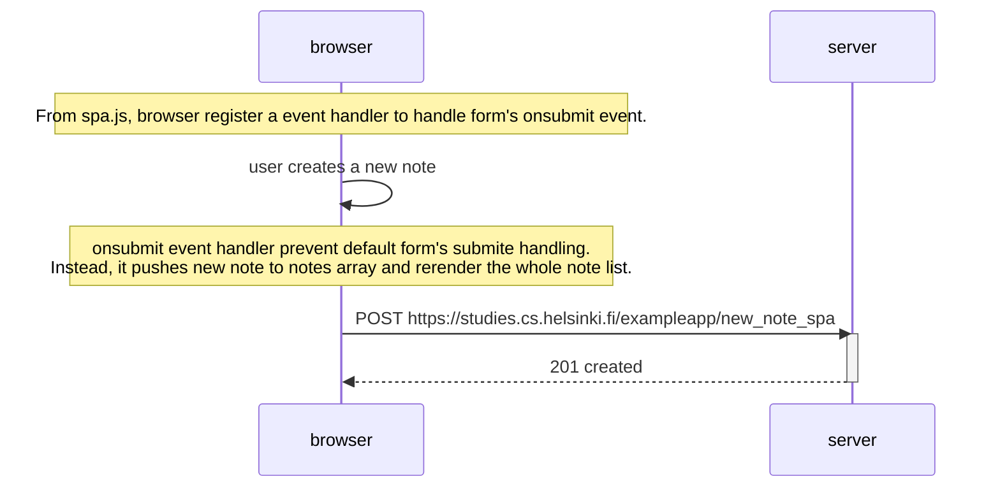

```mermaid
sequenceDiagram
    participant browser
    participant server
    
    note over browser: From spa.js, browser register a event handler to handle form's onsubmit event.

    browser->>browser: user creates a new note

    note over browser: onsubmit event handler prevent default form's submite handling. <br> Instead, it pushes new note to notes array and rerender the whole note list.

    browser->>server: POST https://studies.cs.helsinki.fi/exampleapp/new_note_spa
    activate server
    server-->>browser: 201 created
    deactivate server
```