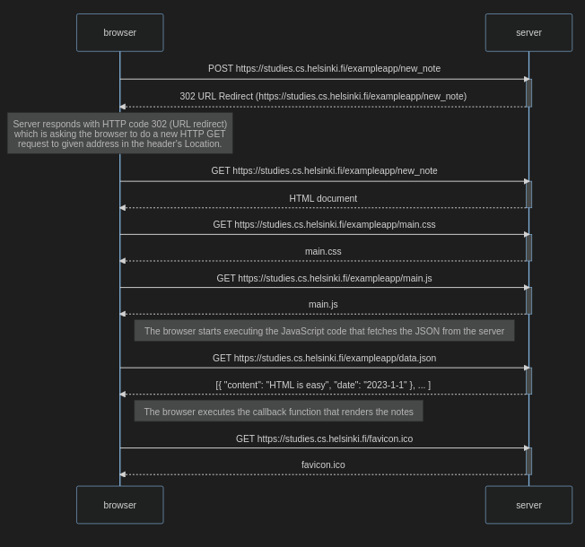

# [Part 0 - Fundamentals of Web apps](https://fullstackopen.com/en/part0)

- General Info
- Fundamentals of Web apps

## [Exercise 4](Exercise4.md)

Create a similar diagram depicting the situation where the user creates a new note on the page <https://studies.cs.helsinki.fi/exampleapp/notes> by writing something into the text field and clicking the submit button.

## [Exercise 5](Exercise5.md)

Create a diagram depicting the situation where the user goes to the single-page app version of the notes app at <https://studies.cs.helsinki.fi/exampleapp/spa>.

## [Exercise 6](Exercise6.md)

Create a diagram depicting the situation where the user creates a new note using the single-page version of the app.

